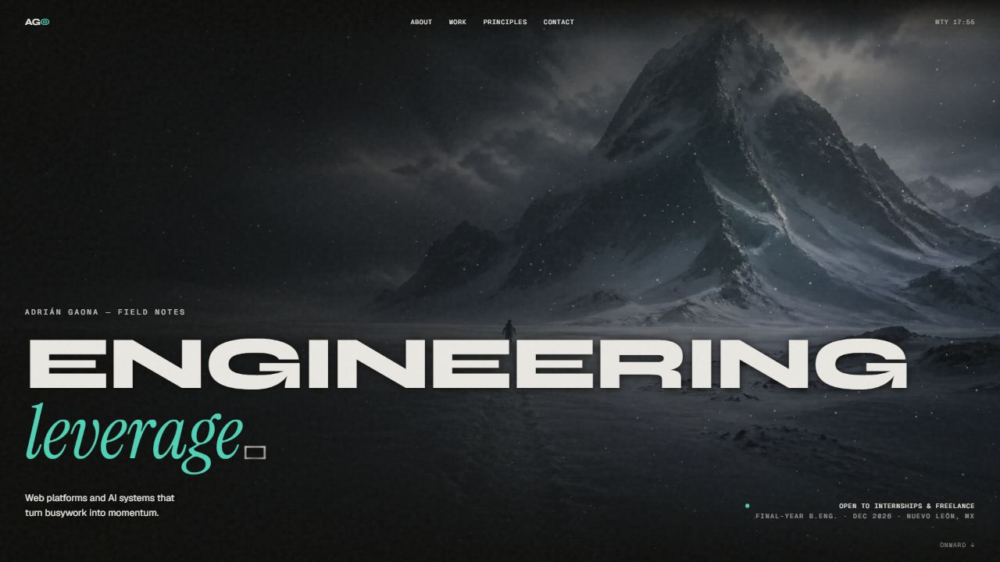
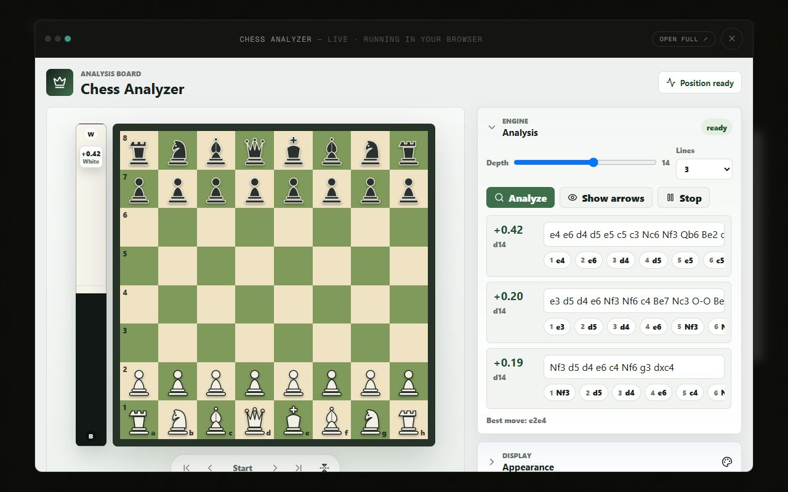
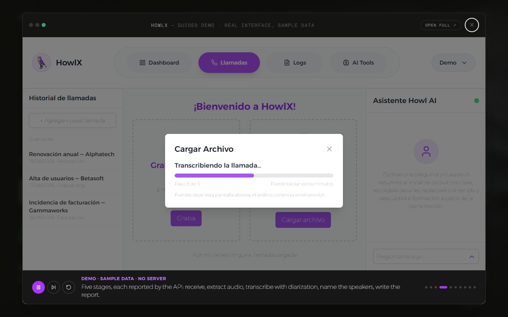

# adriangaona.dev

**A portfolio where the projects run instead of being described.**

This is the source of [www.adriangaona.dev](https://www.adriangaona.dev), the
portfolio of Adrián Gaona, a software engineer in Nuevo León, Mexico. It is
written for the person reviewing the work: most projects can be opened and
used right on the page, so a reviewer can check the claims in a couple of
minutes instead of cloning repos. Apps that need no server run for real in the
browser. Apps that need one show their real interface on sample data, and the
site says which is which.



| Live demo: the real Chess Analyzer, with Stockfish running in the browser | Guided demo: the real HowlX interface on sample data, with a scripted tour |
|---|---|
|  |  |

**Contents:** [What's on the site](#whats-on-the-site) · [How the demos work](#how-the-demos-work) · [Engineering highlights](#engineering-highlights) · [Tech stack and design decisions](#tech-stack-and-design-decisions) · [Project structure](#project-structure) · [Getting started](#getting-started) · [Tests, lint and CI](#tests-lint-and-ci) · [Rebuilding the demos](#rebuilding-the-demos) · [Configuration](#configuration) · [Limitations](#limitations) · [License](#license) · [Author](#author)

## What's on the site

- **Five embedded apps** built from their own repos and served from this one:

  | Project | Demo | Source |
  |---|---|---|
  | Chess Analyzer | [live](https://www.adriangaona.dev/demos/chess/) | [chess-analyzer](https://github.com/jadrianlg16/chess-analyzer) |
  | Financial Sim | [live](https://www.adriangaona.dev/demos/financial-sim/) | [financial-sim](https://github.com/jadrianlg16/financial-sim) |
  | Task Shuffler (the app calls itself *done.*) | [live](https://www.adriangaona.dev/demos/tasklists/) | [task-shuffler](https://github.com/jadrianlg16/task-shuffler) |
  | HowlX | [guided](https://www.adriangaona.dev/demos/howlx/) | [howlx](https://github.com/jadrianlg16/howlx) |
  | Transcript Archive | [guided](https://www.adriangaona.dev/demos/transcript-archive/) | [yt-transcripts](https://github.com/jadrianlg16/yt-transcripts) |

- **Scripted walkthroughs** for apps whose interface can't run without its
  backend: File Converter ([source](https://github.com/jadrianlg16/file-converter)),
  GravityDL and Audiobook Studio.
- **A page per project** at `/work/<slug>` (for example
  [/work/howlx](https://www.adriangaona.dev/work/howlx)) with its own share image
  and structured data, so one project can be sent to one person.
- **A downloadable résumé** at `/downloads/adrian-gaona-resume.pdf`, plus email,
  GitHub and LinkedIn links. The same profiles are listed as `sameAs` in the
  site's `Person` structured data.

## How the demos work

```text
source repos, checked out anywhere (default: beside this one)
  │   node scripts/build-demos.mjs
  │   (runs `npm run build -- --base=/demos/<id>/` in each, copies dist/)
  ▼
public/demos/<id>/          committed static bundles, one folder per app
  │   /demos/<id> redirects to /demos/<id>/, which rewrites to index.html
  ▼
same-origin <iframe>
  ├─ DemoOverlay        full-screen app window launched from the homepage
  └─ ProjectDemoFrame   on-page frame on /work/<slug>
```

The bundles are committed, so Vercel and Docker build this repo on its own,
with no source repos present. [`next.config.ts`](next.config.ts) adds the
directory-index rewrite that `public/` lacks, and
[`src/middleware.ts`](src/middleware.ts) keeps the trailing slash on a demo's
URL, because the apps resolve relative URLs (Task Shuffler's service worker,
for one) against it.

Each demo has one of three kinds, a union type (`ProjectDemo`) in
[`src/app/lib/data.ts`](src/app/lib/data.ts). The overlay and the project page
label each demo from its kind, so a guided demo is never presented as a live one:

- **live** ("live · running in your browser"): the app's real production
  build. In the chess demo, Stockfish really is computing in the visitor's tab.
- **guided** ("guided demo · real interface, sample data"): an app that needs a
  server, rebuilt from its own components with the network layer swapped for
  fixtures. Every click works and a scripted tour plays until the visitor takes
  over. A `demoNote` printed under the frame says which parts are product code
  and which are fixtures.
- **case** ("interactive walkthrough"): a scripted walkthrough in
  [`src/app/components/demos/`](src/app/components/demos/), for apps whose
  interface can't be separated from their backend.

## Engineering highlights

- **On project pages, heavy demos wait until they are affordable.** The chess
  bundle ships a ~7 MB Stockfish WebAssembly binary.
  [`ProjectDemoFrame.tsx`](src/app/components/ProjectDemoFrame.tsx) starts a demo
  automatically only on screens 768 px and wider, and waits for a tap when
  Save-Data is on or the connection reports 2G.
- **Project pages are built for sharing.**
  [`src/app/work/[slug]/page.tsx`](src/app/work/%5Bslug%5D/page.tsx) prerenders
  one page per project with a canonical URL and `SoftwareApplication` +
  `BreadcrumbList` JSON-LD.
  [`opengraph-image.tsx`](src/app/work/%5Bslug%5D/opengraph-image.tsx) renders a
  share card per project from that project's color palette.
- **The 3D hero degrades instead of stuttering.**
  [`AlpineScene.tsx`](src/app/components/AlpineScene.tsx) starts on a lighter
  tier on constrained devices (touch screens, viewports under 768 px, 4 or fewer
  cores, 4 GB or less memory, or Save-Data). Elsewhere it measures the real frame
  rate for two seconds and, under 24 fps, drops to 30 fps and fewer particles.
  [`scripts/check-frame-probe.mjs`](scripts/check-frame-probe.mjs) replays
  synthetic frame timings against that rule as part of `npm test`.
- **One source for the site's own URL.** Canonical URLs, Open Graph, the
  sitemap, robots.txt and JSON-LD all come from
  [`src/app/lib/site.ts`](src/app/lib/site.ts), which validates
  `NEXT_PUBLIC_SITE_URL` at build time, so a typo fails the build instead of
  publishing wrong canonical URLs.
- **Security headers on every response.** [`next.config.ts`](next.config.ts)
  sends a Content Security Policy (`frame-ancestors 'self'`, so no other site
  can frame these pages; `'wasm-unsafe-eval'` so Stockfish can compile), plus
  `nosniff`, a referrer policy and a permissions policy that turns off camera,
  microphone and geolocation. Every page and all five demos run under it with
  no violations.

## Tech stack and design decisions

| Choice | Why |
|---|---|
| Next.js 15 (App Router), React 19, TypeScript, Tailwind CSS 4 | Every route is prerendered at build time, including one page and one share image per project. Metadata, sitemap, robots and manifest are file-based. |
| GSAP + ScrollTrigger, Lenis, three.js | Scroll-driven motion, smooth scrolling and the hero snowfall. Lenis is stopped while a demo overlay is open, so the page underneath doesn't scroll. |
| Same-origin iframes for demos | Each app keeps its own build, dependencies and CSS, so no app can break another or the site's styles. The same URL also opens full-screen in a new tab. Each frame's `sandbox` comes from [`src/app/lib/sandbox.ts`](src/app/lib/sandbox.ts); see the limitation on isolation below. |
| One content file | Projects (with their demo kinds), capabilities, principles and contact details live in `src/app/lib/data.ts`. Adding a project is an entry there, plus its demo bundle or walkthrough component if it has one. |

## Project structure

```text
.github/workflows/ci.yml   lint, type-check, test and build on every push
scripts/
  build-demos.mjs          builds the source repos into public/demos/<id>/
  check-frame-probe.mjs    tests the hero's quality rule against frame timings
public/
  demos/                   committed bundles, one folder per demo
  images/, downloads/      hero art, photos, screenshots; résumé PDF
cv/                        résumé source (.docx) and archived PDFs, not served
src/
  middleware.ts            /demos/<id> → /demos/<id>/ (+ middleware.test.ts)
src/app/
  lib/data.ts              projects and their demo kinds, capabilities, contact
  lib/site.ts              the site's public URL (+ site.test.ts)
  lib/sandbox.ts           each demo frame's sandbox (+ sandbox.test.ts)
  components/
    DemoOverlay.tsx        the full-screen app window every demo opens in
    ProjectDemoFrame.tsx   the on-page demo frame on /work/<slug>
    AlpineScene.tsx        three.js hero with adaptive quality
    demos/                 scripted walkthroughs (kind "case")
  work/[slug]/             per-project page and share image
  layout.tsx, page.tsx     site shell and homepage
  sitemap.ts, robots.ts, manifest.ts, opengraph-image.tsx
next.config.ts             security headers; /demos/<id>/ → index.html rewrite
THIRD-PARTY.md             third-party code and content inside public/demos/
DEPLOY.md                  how the site is deployed on Vercel, and its DNS
Dockerfile
```

## Getting started

**Prerequisites:** Node.js 20.9 or newer (CI runs 20 and 22) and npm 10. Docker is optional.

```bash
git clone https://github.com/jadrianlg16/AdrianGaona.git && cd AdrianGaona
npm ci
npm run dev        # http://localhost:3000
```

The demos are already built and committed, so they work straight away at
`/demos/<id>/`.

**Production build:**

```bash
npm run build
npm start          # http://localhost:3000
```

If you ran the dev server after building, build again first: both use `.next/`.

**Docker:**

```bash
docker build -t portfolio .
docker run --rm -p 3000:3000 portfolio
```

## Tests, lint and CI

```bash
npm test             # node:test, via tsx for the TypeScript module under test
npm run lint         # ESLint (Next.js core-web-vitals + TypeScript rules), 0 warnings allowed
npm run typecheck    # tsc --noEmit
npm run build        # production build
```

`npm test` covers the logic that can run outside a browser:

- the hero's frame-rate rule against synthetic timings (a 60 Hz screen at
  30 fps must not count as slow; a backgrounded tab must not count at all);
- the site URL rules (default, normalization, and the values that must fail the
  build);
- the demo sandbox (an isolated demo never gets `allow-same-origin`);
- the demo URL redirect (adds the slash, keeps the query, skips assets).

The rest of the site is layout and animation, checked by building it and using
it.

[`.github/workflows/ci.yml`](.github/workflows/ci.yml) runs `npm ci`, then the
four commands above, on Node 20 and 22 for every push.

## Rebuilding the demos

Only needed after changing one of the source projects:

```bash
node scripts/build-demos.mjs --list            # where each source will be read from
node scripts/build-demos.mjs                   # all five
node scripts/build-demos.mjs chess             # one, by id
node scripts/build-demos.mjs chess --src path/to/chess-analyzer   # from any checkout
```

| Demo id | Source repo | Built from |
|---|---|---|
| `chess` | [chess-analyzer](https://github.com/jadrianlg16/chess-analyzer) | repo root |
| `financial-sim` | [financial-sim](https://github.com/jadrianlg16/financial-sim) | repo root |
| `tasklists` | [task-shuffler](https://github.com/jadrianlg16/task-shuffler) | repo root, with `VITE_STORAGE=local` |
| `howlx` | [howlx](https://github.com/jadrianlg16/howlx) | `demo/`, which also needs `web/`'s dependencies |
| `transcript-archive` | [yt-transcripts](https://github.com/jadrianlg16/yt-transcripts) | `demo/` |

The script looks for each repo in this order: `--src <path>` (one demo at a
time); an entry in `demos.local.json`, a git-ignored file mapping demo ids to
checkout paths, relative to this repo or absolute; then a sibling folder named
after the repo, such as `../chess-analyzer`.

```json
{ "chess": "../chess", "howlx": "/code/howlx" }
```

Each source needs its dependencies installed; `--install` runs `npm ci` in
every folder that needs it first. `--out <dir>` writes to `<dir>/<id>/`
instead of `public/demos/`. An embeddable app builds to static files, uses
base-relative asset URLs (`import.meta.env.BASE_URL`) and needs no backend at
runtime. The script fails if a bundle's `index.html` comes out without its
`/demos/<id>/` base path.

## Configuration

| Variable | Default | Purpose |
|---|---|---|
| `NEXT_PUBLIC_SITE_URL` | `https://www.adriangaona.dev` | The site's public origin, used for canonical URLs, Open Graph, the sitemap, robots.txt and JSON-LD. Read at build time; must be an `http(s)` origin with no path. In Docker, pass it with `--build-arg NEXT_PUBLIC_SITE_URL=…`. |
| `PORT` | `3000` | Port for `npm start` (read by Next.js). |

## Limitations

- **The demos are desktop-first.** The apps were built for desktop screens, so on
  phones the project page asks before loading one.
- **Guided demos and walkthroughs don't compute anything.** In the HowlX demo no
  model runs and no call is transcribed. In the Transcript Archive demo, Fetch
  fails on purpose because there is no backend to reach YouTube. The
  walkthroughs are scripted re-creations of each app's flow, not the app itself.
- **Committed bundles can drift from their source.** Nothing checks that they
  still match; rebuild after changing a source project. The Transcript Archive
  demo's source (`demo/` in yt-transcripts) is not on that repo's public default
  branch yet, so its bundle can't be rebuilt from public code today.
- **Only one demo is isolated from the site.** Financial Sim runs in a sandbox
  with an opaque origin, so it cannot touch this site's pages or storage. The
  other four use `localStorage` or `sessionStorage` as they start and break
  without `allow-same-origin`, so their frames keep it. Combined with
  `allow-scripts`, that flag is not a security boundary: their code could reach
  the page around them. All five are built from the projects linked above and
  committed here. The real fix is serving `/demos/` from a separate origin,
  such as a `demos.` subdomain. Opening any demo full screen runs it on the
  site's origin either way.
- **Analytics only work on Vercel.** Elsewhere, including the Docker image, the
  Vercel Analytics script request returns 404. The site still works.

## License

Copyright © 2026 Adrián Gaona. All rights reserved. The source is public so it
can be read and evaluated; no license is granted to reuse or redistribute it.

The demo bundles in `public/demos/` contain third-party code and transcript
excerpts, listed in [THIRD-PARTY.md](THIRD-PARTY.md). The one with copyleft
terms is **Stockfish 18** (GPL-3.0-or-later), shipped unmodified in
`public/demos/chess/vendor/stockfish/` with its
[license text](public/demos/chess/vendor/stockfish/LICENSE). It runs as a
separate Web Worker and is not linked into the site's code.

## Author

**Adrián Gaona** · [adriangaona.dev](https://www.adriangaona.dev) · [LinkedIn](https://www.linkedin.com/in/jesus-lopez-95762b2b6) · [GitHub](https://github.com/jadrianlg16)
